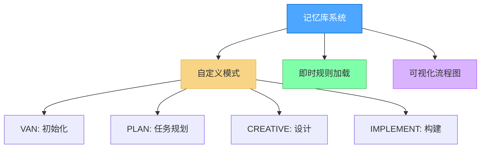
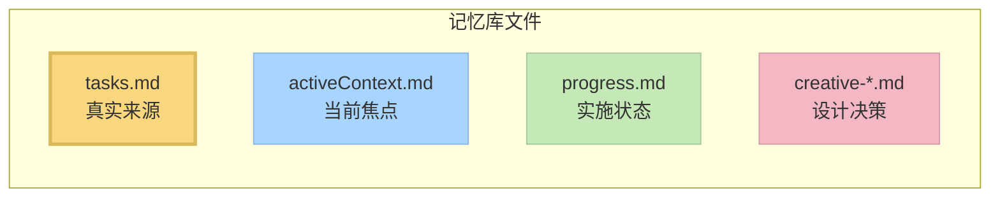

# 记忆库系统 v0.6-beta

一个模块化、基于图的任务管理系统，集成了Cursor自定义模式，实现高效开发工作流。



> **开发状态**：该系统正在积极开发中。功能将随时间添加和优化。如果您更喜欢稳定性而非新功能，可以继续使用先前版本(v0.1-legacy)，但请阅读[记忆库升级指南](memory_bank_upgrade_guide.md)了解这种新方法的好处。

## 关于记忆库

记忆库是一个个人项目，为开发过程的不同阶段提供专门模式，实现结构化的开发方法。它使用即时(JIT)规则加载架构，仅加载每个阶段所需的规则，优化上下文使用并提供定制指导。

### 超越基本自定义模式

虽然Cursor文档将自定义模式描述为主要是带有基本提示和工具选择的独立配置，但记忆库显著扩展了这一概念：

- **基于图的模式集成**：模式是开发工作流中的互连节点，而非孤立工具
- **工作流程进展**：模式设计为按逻辑顺序从一个过渡到另一个(VAN → PLAN → CREATIVE → IMPLEMENT)
- **共享内存**：通过记忆库文件在模式转换过程中维持持久状态
- **自适应行为**：每种模式根据项目复杂性调整其建议
- **内置QA功能**：可以从任何模式调用QA功能进行技术验证

这种方法将自定义模式从简单的AI角色转变为协调开发系统的组件，具有专门的协同工作阶段。

### 隔离规则架构

v0.6-beta的关键架构变化是将规则完全隔离到自定义模式：

- **无全局规则**：与之前版本不同，该系统不使用影响所有AI交互的全局规则
- **仅模式特定规则**：所有规则都包含在其特定自定义模式中，VAN作为入口点
- **不干扰**：当您不使用记忆库自定义模式时，您的常规Cursor使用完全不受记忆库自定义的影响
- **面向未来**：这种隔离保持全局规则空间空闲，可用于潜在的未来功能

这种架构变化使您能更好地控制记忆库系统何时以及如何影响您的Cursor体验。

### CREATIVE模式和Claude的"Think"工具

记忆库中的CREATIVE模式在概念上基于Anthropic的Claude "Think"工具方法，如其[工程博客](https://www.anthropic.com/engineering/claude-think-tool)所述。关键原则包括：

- 结构化探索设计选项
- 明确记录不同方法的优缺点
- 将复杂问题分解为可管理的组件
- 系统化过程，在做决定前评估替代方案
- 记录推理过程供未来参考

有关记忆库如何实现这些原则的详细解释，包括代码示例和图表，请参阅[CREATIVE模式和Claude的"Think"工具](creative_mode_think_tool.md)文档。

随着Claude能力的发展，该实现将继续完善和优化，保持核心方法论同时增强与记忆库生态系统的集成。

## 关键特性

- **模式特定可视化图表**：每个开发阶段的清晰可视表示
- **即时规则加载**：仅加载当前任务所需的规则
- **可视化决策树**：带有明确检查点的引导工作流
- **技术验证**：可从任何模式调用的QA流程
- **平台感知命令**：自动适应您的操作系统命令

## 安装说明

### 前提条件

- **Cursor编辑器**：需要版本0.48或更高。
- **自定义模式**：必须在Cursor中启用此功能(设置 → 功能 → 聊天 → 自定义模式)。
- **AI模型**：推荐使用Claude 3.7 Sonnet获得最佳效果，特别是对于CREATIVE模式的"Think"工具方法。其他模型可能有效，但解释可能有所不同，可能需要一些尝试和错误。

### 步骤1：获取文件

只需将此存储库克隆到您的项目目录：

```
git clone https://github.com/vanzan01/cursor-memory-bank.git

```

或者，您可以从GitHub下载ZIP文件并解压到项目文件夹。

这将为您提供所有必要的文件，包括：
- `.cursor/rules/isolation_rules/`中的规则文件
- `custom_modes/`目录中的模式指令文件
- `memory-bank/`中的模板记忆库文件

### 步骤2：在Cursor中设置自定义模式

**这是设置中最关键且具挑战性的部分。**您需要在Cursor中手动创建四个自定义模式并从提供的文件中复制指令内容：

#### 如何在Cursor中添加自定义模式

1. 打开Cursor并点击聊天面板中的模式选择器
2. 选择"添加自定义模式"
3. 在配置屏幕中：
   - 输入模式名称(您可以通过复制粘贴在名称开头添加表情图标，如🔍, 📋, 🎨, ⚒️)
   - 从Cursor有限的预定义选项中选择图标(注意：Cursor只提供几个基本图标，但您可以在名称中使用表情作为变通方法)
   - 添加快捷方式(可选)
   - 勾选所需工具
   - 点击**高级选项**
   - 在底部出现的空文本框中，从相应文件粘贴自定义指令内容

<table>
  <tr>
    <td align="center"><em>示例配置屏幕：</em></td>
    <td align="center"><em>模式选择菜单中的结果：</em></td>
  </tr>
  <tr>
    <td valign="top">
      
    </td>
    <td valign="top">
      
    </td>
  </tr>
</table>

#### 模式1：VAN模式(初始化)

配置如下：
- **名称**：🔍 VAN(复制粘贴放大镜表情)
- **图标**：从Cursor有限选择中选择任意可用图标
- **工具**：启用"代码库搜索"、"读取文件"、"终端"、"列出目录"
- **高级选项**：将此存储库中`custom_modes/van_instructions.md`的内容粘贴到底部文本框

#### 模式2：PLAN模式(任务规划)

配置如下：
- **名称**：📋 PLAN(复制粘贴剪贴板表情)
- **图标**：从Cursor有限选择中选择任意可用图标
- **工具**：启用"代码库搜索"、"读取文件"、"终端"、"列出目录"
- **高级选项**：将此存储库中`custom_modes/plan_instructions.md`的内容粘贴到底部文本框

#### 模式3：CREATIVE模式(设计决策)

配置如下：
- **名称**：🎨 CREATIVE(复制粘贴艺术调色板表情)
- **图标**：从Cursor有限选择中选择任意可用图标
- **工具**：启用"代码库搜索"、"读取文件"、"终端"、"列出目录"、"编辑文件"
- **高级选项**：将此存储库中`custom_modes/creative_instructions.md`的内容粘贴到底部文本框

#### 模式4：IMPLEMENT模式(代码实现)

配置如下：
- **名称**：⚒️ IMPLEMENT(复制粘贴锤子和镐表情)
- **图标**：从Cursor有限选择中选择任意可用图标
- **工具**：启用所有工具
- **高级选项**：将此存储库中`custom_modes/implement_instructions.md`的内容粘贴到底部文本框

有关在Cursor中设置自定义模式的更多帮助，请参阅[Cursor自定义模式官方文档](https://docs.cursor.com/chat/custom-modes)。

### QA功能

QA不是单独的自定义模式，而是可从任何模式调用的一组验证功能。当需要执行技术验证时，您可以在任何模式中键入"QA"来调用QA功能。这种方法提供了在开发过程中任何时点进行验证的灵活性。

### 文件结构参考

克隆后，您将具有以下目录结构：

```
your-project/
├── .cursor/
│   └── rules/
│       └── isolation_rules/
│           ├── Core/
│           ├── Level3/
│           ├── Phases/
│           │   └── CreativePhase/
│           ├── visual-maps/
│           │   └── van_mode_split/
│           └── main.mdc
├── memory-bank/
│   ├── tasks.md
│   ├── activeContext.md
│   └── progress.md
└── custom_modes/
    ├── van_instructions.md
    ├── plan_instructions.md
    ├── creative_instructions.md
    ├── implement_instructions.md
```

## 基本用法

1. **从VAN模式开始**：
   - 在Cursor中切换到VAN模式
   - 输入"VAN"启动初始化过程
   - VAN将分析您的项目结构并确定复杂性

2. **根据复杂性遵循工作流**：
   - **第1级任务**：VAN后可直接进入IMPLEMENT
   - **第2-4级任务**：遵循完整工作流(VAN → PLAN → CREATIVE → IMPLEMENT)
   - **任何时点**：输入"QA"执行技术验证

3. **模式特定命令**：
   ```
   VAN - 初始化项目并确定复杂性
   PLAN - 创建详细实施计划
   CREATIVE - 探索复杂组件的设计选项
   IMPLEMENT - 系统地构建计划组件
   QA - 验证技术实施(可从任何模式调用)
   ```

## 核心文件及其用途



- **tasks.md**：任务跟踪的中心真实来源
- **activeContext.md**：维持当前开发阶段的焦点
- **progress.md**：跟踪实施状态
- **creative-*.md**：CREATIVE模式期间生成的设计决策文档

## 故障排除

### 常见问题

1. **模式没有正确响应**：
   - 验证自定义指令是否完全复制(这是最常见的问题)
   - 确保每种模式启用了正确的工具
   - 检查在发出命令前是否已切换到正确的模式
   - 确保将指令粘贴到"高级选项"文本框中

2. **规则未加载**：
   - 确保`.cursor/rules/isolation_rules/`目录位于正确位置
   - 验证文件权限允许读取规则文件

3. **命令执行问题**：
   - 确保从正确目录运行命令
   - 验证平台特定命令使用正确

## 版本信息

这是记忆库系统的v0.6-beta版本。它设计用于新项目和实验性使用。没有从旧版本(v0.1-legacy)的正式迁移路径，因此建议使用新项目重新开始。

### 持续开发

记忆库系统正在积极开发和改进中。需要了解的要点：

- **进行中的工作**：这是一个持续开发的测试版。预期会有定期更新、优化和新功能。
- **功能优化**：模块化架构使得持续改进不会破坏现有功能。
- **前一版本可用**：如果您更喜欢前一版本(v0.1-legacy)的稳定性，可以继续使用它，同时此版本逐渐成熟。
- **架构优势**：在决定使用哪个版本之前，请阅读[记忆库升级指南](memory_bank_upgrade_guide.md)，了解新架构的显著优势，包括改进的上下文效率、可视指导和模式特定优化。

## 开发者说明

这是一个给我带来构建和开发乐趣的个人爱好项目。我欢迎反馈和改进建议。该系统设计用于实验，可能会根据用户体验显著发展。

## 资源

- [Cursor自定义模式文档](https://docs.cursor.com/chat/custom-modes)
- [记忆库升级指南](memory_bank_upgrade_guide.md)
- [CREATIVE模式和Claude的"Think"工具](creative_mode_think_tool.md)
- `custom_modes/`目录中的模式特定指令文件

---

*注：此README适用于v0.6-beta，随系统发展可能会有变化。* 
