# CREATIVE模式和Claude的"Think"工具

本文档解释了记忆库的CREATIVE模式如何实现类似于Anthropic的Claude "Think"工具方法论的概念，如他们的[工程博客](https://www.anthropic.com/engineering/claude-think-tool)所述。

## 概念并行

以下图表说明了Claude的"Think"工具方法论和记忆库的CREATIVE模式之间的概念相似性：

```mermaid
graph TD
    subgraph "Claude Think Tool Approach"
        CT1["1: Decompose Problem"] --> CT2["2: Explore Solution Space"]
        CT2 --> CT3["3: Analyze Trade-offs"]
        CT3 --> CT4["4: Select & Document Decision"]
        CT4 --> CT5["5: Validate Decision"]
    end
    
    subgraph "Memory Bank CREATIVE Mode"
        CM1["1: Component Breakdown"] --> CM2["2: Option Exploration"]
        CM2 --> CM3["3: Trade-off Analysis"]
        CM3 --> CM4["4: Decision Documentation"]
        CM4 --> CM5["5: Decision Verification"]
    end
    
    style CT1 fill:#f9d77e,stroke:#d9b95c
    style CT2 fill:#f9d77e,stroke:#d9b95c
    style CT3 fill:#f9d77e,stroke:#d9b95c
    style CT4 fill:#f9d77e,stroke:#d9b95c
    style CT5 fill:#f9d77e,stroke:#d9b95c
    
    style CM1 fill:#a8d5ff,stroke:#88b5e0
    style CM2 fill:#a8d5ff,stroke:#88b5e0
    style CM3 fill:#a8d5ff,stroke:#88b5e0
    style CM4 fill:#a8d5ff,stroke:#88b5e0
    style CM5 fill:#a8d5ff,stroke:#88b5e0
```



## Claude的"Think"工具核心原则

Claude的"Think"工具方法论围绕以下几点：

1. **结构化思考过程**：将复杂问题分解为可管理的组件
2. **明确推理**：清晰记录推理过程
3. **选项探索**：系统地探索多种解决方案方法
4. **权衡分析**：权衡不同选项的利弊
5. **决策文档**：创建决策及其理由的记录

## CREATIVE模式如何实现这些原则

记忆库CREATIVE模式通过以下方式实现类似概念：

### 1. 结构化阶段

CREATIVE模式通过明确的阶段强制执行设计决策的结构化方法：

```
阶段1：组件分解
阶段2：选项探索
阶段3：权衡分析
阶段4：决策文档
阶段5：决策验证
```

每个阶段都有在继续之前必须满足的特定输出和接受标准。

### 2. 组件分解模板

CREATIVE模式提供用于分解复杂组件的模板：

```markdown
# 组件：[组件名称]

## 功能需求
- [需求1]
- [需求2]

## 技术约束
- [约束1]
- [约束2]

## 集成点
- [集成点1]
- [集成点2]
```

### 3. 选项探索模板

用于探索设计替代方案：

```markdown
# 设计选项：[选项名称]

## 核心方法
[方法简要描述]

## 实施细节
[关键实施考虑因素]

## 初步评估
- **优势**：[列出优势]
- **劣势**：[列出劣势]
- **未知**：[列出未知]
```

### 4. 权衡分析矩阵

用于系统比较选项：

```markdown
# 权衡分析

| 标准 | 选项A | 选项B | 选项C |
|-----------|----------|----------|----------|
| 性能 | 评分 | 评分 | 评分 |
| 可维护性 | 评分 | 评分 | 评分 |
| 可扩展性 | 评分 | 评分 | 评分 |
| 复杂性 | 评分 | 评分 | 评分 |
| 风险 | 评分 | 评分 | 评分 |

## 详细分析
[权衡的详细讨论]
```

### 5. 决策文档

用于捕获带有理由的最终决策：

```markdown
# 设计决策：[决策名称]

## 选定的方法
[所选方法的描述]

## 理由
[解释为什么选择这种方法]

## 放弃的替代方案
[考虑但未选择的替代方案的简要描述]

## 实施指导
[指导实施的注意事项]
```

## 实践示例

以下是设计数据缓存系统时CREATIVE模式会话可能的简化示例：

### 步骤1：分解问题

```
CREATIVE：让我们为我们的应用程序设计一个缓存系统。首先，让我们分解组件和需求。

组件：数据缓存系统

功能需求：
- 存储频繁访问的数据以减少数据库负载
- 提供可配置的过期策略
- 处理缓存失效
- 支持跨应用程序实例的分布式缓存

技术约束：
- 必须与现有Redis基础设施配合使用
- 内存使用不得超过2GB
- 缓存操作必须在10ms内完成
```

### 步骤2：探索选项

```
让我们探索三个设计选项：

选项A：简单Redis键值实现
- 直接使用Redis键值存储与字符串序列化
- 简单的基于TTL的过期
- 通过直接键删除的手动失效

选项B：基于Redis哈希的层次缓存
- 按实体类型在Redis哈希中组织数据
- 使用Redis发布/订阅进行失效通知
- 实施层次过期策略

选项C：混合本地-Redis缓存
- 本地内存LRU缓存作为第一级
- Redis作为第二级分布式缓存
- 级别之间的后台同步
```

### 步骤3：分析权衡

```
权衡分析：

| 标准 | 选项A | 选项B | 选项C |
|-----------|----------|----------|----------|
| 实施复杂性 | 低 | 中 | 高 |
| 性能 | 中 | 中 | 高 |
| 内存效率 | 中 | 高 | 中 |
| 可扩展性 | 中 | 高 | 高 |
| 维护 | 低 | 中 | 高 |

详细分析：
- 选项A最简单但提供有限功能
- 选项B提供性能和功能的良好平衡
- 选项C提供最佳性能但复杂度较高
```

### 步骤4：记录决策

```
设计决策：基于Redis哈希的层次缓存（选项B）

理由：
- 在性能和可维护性之间提供良好平衡
- 由于Redis哈希结构，比选项A具有更好的内存效率
- 复杂度低于选项C，同时仍满足性能要求
- 更好地支持我们的分布式架构

实施指导：
- 创建带有实体特定API的CacheManager类
- 实施Redis发布/订阅监听器用于失效事件
- 添加缓存命中/未命中率的监控
```

## 核心方法论对齐

上述示例中的结构化方法反映了Claude的"Think"工具方法论，通过：

1. **分解**缓存问题为特定需求和约束
2. 系统地**探索**多个设计选项
3. 使用明确标准**分析权衡**
4. 以明确理由**记录决策**
5. 基于决策提供**实施指导**

## 对开发过程的影响

通过实施这些受Claude启发的方法论，CREATIVE模式提供了几个好处：

1. **改进决策质量**：更系统地探索选项
2. **更好的决策文档**：明确捕获设计理由
3. **知识保存**：设计决策保存以供将来参考
4. **减少设计偏见**：结构化方法减少认知偏见
5. **更清晰的实施指导**：实施阶段有更明确的方向

## 持续改进

随着Claude能力的发展，CREATIVE模式对这些方法论的实施将被完善以：

- 整合结构化思考方法的进步
- 改进设计决策的模板和框架
- 增强与其他记忆库模式的集成
- 优化结构和灵活性之间的平衡

目标是保持核心方法论，同时在记忆库生态系统内不断改进其实际实施。

---

*注：本文档描述了记忆库v0.6-beta如何实现类似于Claude的"Think"工具方法论的概念。随着两个系统的成熟，实施将继续发展。* 