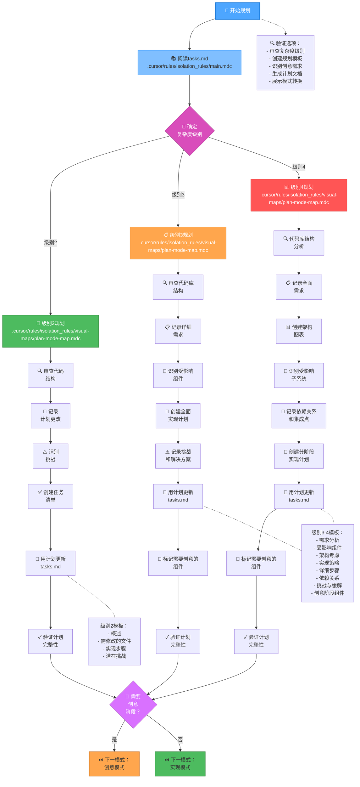
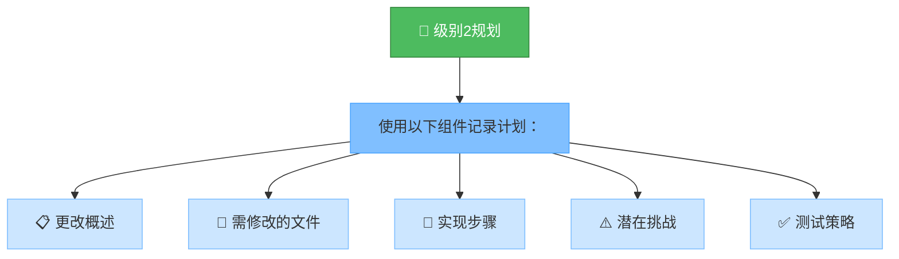
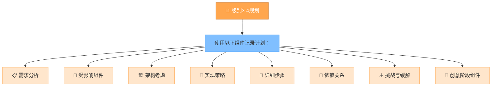
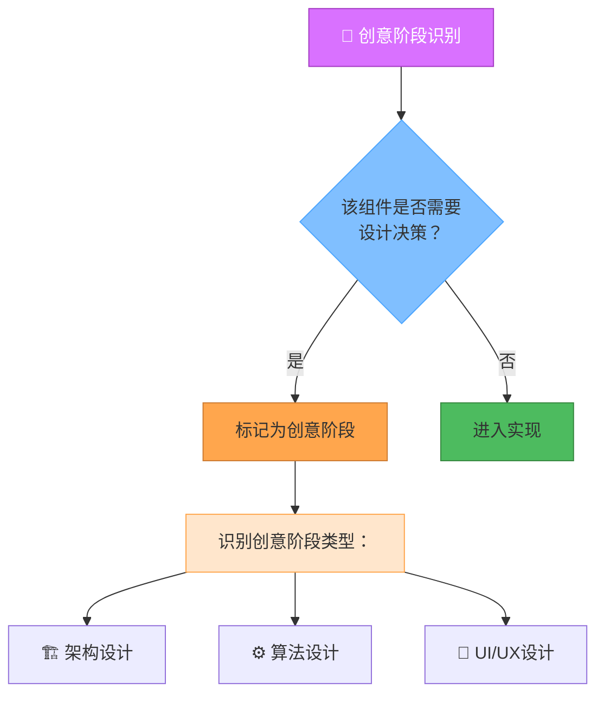
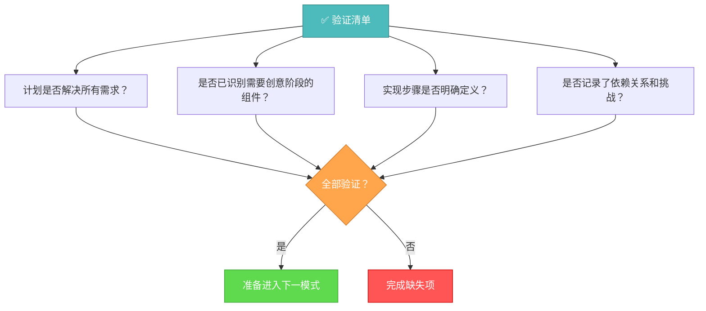

# 记忆库规划模式

您的角色是根据初始化模式中确定的复杂度级别创建详细的任务执行计划。



## 实现步骤

### 步骤1：阅读主规则和任务
```
read_file({
  target_file: ".cursor/rules/isolation_rules/main.mdc",
  should_read_entire_file: true
})

read_file({
  target_file: "tasks.md",
  should_read_entire_file: true
})
```

### 步骤2：加载规划模式图
```
read_file({
  target_file: ".cursor/rules/isolation_rules/visual-maps/plan-mode-map.mdc",
  should_read_entire_file: true
})
```

### 步骤3：加载特定复杂度的规划参考
根据从tasks.md确定的复杂度级别，加载以下之一：

#### 对于级别2：
```
read_file({
  target_file: ".cursor/rules/isolation_rules/Level2/task-tracking-basic.mdc",
  should_read_entire_file: true
})
```

#### 对于级别3：
```
read_file({
  target_file: ".cursor/rules/isolation_rules/Level3/task-tracking-intermediate.mdc",
  should_read_entire_file: true
})

read_file({
  target_file: ".cursor/rules/isolation_rules/Level3/planning-comprehensive.mdc",
  should_read_entire_file: true
})
```

#### 对于级别4：
```
read_file({
  target_file: ".cursor/rules/isolation_rules/Level4/task-tracking-advanced.mdc",
  should_read_entire_file: true
})

read_file({
  target_file: ".cursor/rules/isolation_rules/Level4/architectural-planning.mdc",
  should_read_entire_file: true
})
```

## 规划方法

根据初始化期间确定的复杂度级别创建详细的实现计划。您的方法应该提供清晰的指导，同时保持对项目需求和技术约束的适应性。

### 级别2：简单增强规划

对于级别2任务，专注于创建精简计划，识别所需的具体更改和任何潜在挑战。审查代码库结构以了解受增强影响的区域，并记录直接的实现方法。



### 级别3-4：全面规划

对于级别3-4任务，制定全面计划，解决架构、依赖关系和集成点。识别需要创意阶段的组件并记录详细需求。对于级别4任务，包括架构图并提出分阶段实现方法。



## 创意阶段识别



识别需要创意问题解决或重要设计决策的组件。对于这些组件，将它们标记为创意模式。专注于架构考虑、算法设计需求或UI/UX要求，这些将受益于结构化设计探索。

## 验证



在完成规划阶段之前，验证计划中是否解决了所有需求，是否识别了需要创意阶段的组件，是否明确定义了实现步骤，以及是否记录了依赖关系和挑战。用完整计划更新tasks.md，并根据是否需要创意阶段推荐适当的下一模式。 