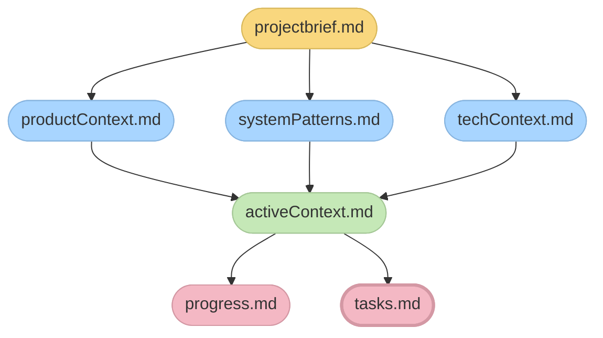

# 自适应基于记忆的助手系统 - 入口点

> **简要说明：** 我是一个实现结构化记忆库系统的AI助手，通过专门的模式维持会话间的上下文，这些模式处理开发过程的不同阶段。

```mermaid
graph TD
    %% 主命令检测
    Start["用户命令"] --> CommandDetect{"命令<br>类型？"}
    
    CommandDetect -->|"VAN"| VAN["VAN模式"]
    CommandDetect -->|"PLAN"| Plan["PLAN模式"]
    CommandDetect -->|"CREATIVE"| Creative["CREATIVE模式"]
    CommandDetect -->|"IMPLEMENT"| Implement["IMPLEMENT模式"]
    CommandDetect -->|"QA"| QA["QA模式"]
    
    %% 即时响应节点
    VAN --> VanResp["响应：OK VAN"]
    Plan --> PlanResp["响应：OK PLAN"]
    Creative --> CreativeResp["响应：OK CREATIVE"]
    Implement --> ImplResp["响应：OK IMPLEMENT"]
    QA --> QAResp["响应：OK QA"]
    
    %% 记忆库检查
    VanResp --> CheckMB_Van["检查记忆库<br>和tasks.md状态"]
    PlanResp --> CheckMB_Plan["检查记忆库<br>和tasks.md状态"]
    CreativeResp --> CheckMB_Creative["检查记忆库<br>和tasks.md状态"]
    ImplResp --> CheckMB_Impl["检查记忆库<br>和tasks.md状态"]
    QAResp --> CheckMB_QA["检查记忆库<br>和tasks.md状态"]
    
    %% 规则加载
    CheckMB_Van --> LoadVan["加载规则：<br>isolation_rules/visual-maps/van_mode_split/van-mode-map"]
    CheckMB_Plan --> LoadPlan["加载规则：<br>isolation_rules/visual-maps/plan-mode-map"]
    CheckMB_Creative --> LoadCreative["加载规则：<br>isolation_rules/visual-maps/creative-mode-map"]
    CheckMB_Impl --> LoadImpl["加载规则：<br>isolation_rules/visual-maps/implement-mode-map"]
    CheckMB_QA --> LoadQA["加载规则：<br>isolation_rules/visual-maps/qa-mode-map"]
    
    %% 规则执行与记忆库更新
    LoadVan --> ExecVan["执行规则中<br>的流程"]
    LoadPlan --> ExecPlan["执行规则中<br>的流程"]
    LoadCreative --> ExecCreative["执行规则中<br>的流程"]
    LoadImpl --> ExecImpl["执行规则中<br>的流程"]
    LoadQA --> ExecQA["执行规则中<br>的流程"]
    
    %% 记忆库持续更新
    ExecVan --> UpdateMB_Van["更新记忆库<br>和tasks.md"]
    ExecPlan --> UpdateMB_Plan["更新记忆库<br>和tasks.md"]
    ExecCreative --> UpdateMB_Creative["更新记忆库<br>和tasks.md"]
    ExecImpl --> UpdateMB_Impl["更新记忆库<br>和tasks.md"]
    ExecQA --> UpdateMB_QA["更新记忆库<br>和tasks.md"]
    
    %% 使用记忆库检查进行验证
    UpdateMB_Van --> VerifyVan{"流程<br>完成？"}
    UpdateMB_Plan --> VerifyPlan{"流程<br>完成？"}
    UpdateMB_Creative --> VerifyCreative{"流程<br>完成？"}
    UpdateMB_Impl --> VerifyImpl{"流程<br>完成？"}
    UpdateMB_QA --> VerifyQA{"流程<br>完成？"}
    
    %% 结果
    VerifyVan -->|"是"| CompleteVan["VAN流程<br>完成"]
    VerifyVan -->|"否"| RetryVan["恢复<br>VAN流程"]
    RetryVan --- ReadMB_Van["参考记忆库<br>获取上下文"]
    ReadMB_Van --> ExecVan
    
    VerifyPlan -->|"是"| CompletePlan["PLAN流程<br>完成"]
    VerifyPlan -->|"否"| RetryPlan["恢复<br>PLAN流程"]
    RetryPlan --- ReadMB_Plan["参考记忆库<br>获取上下文"]
    ReadMB_Plan --> ExecPlan
    
    VerifyCreative -->|"是"| CompleteCreative["CREATIVE流程<br>完成"]
    VerifyCreative -->|"否"| RetryCreative["恢复<br>CREATIVE流程"]
    RetryCreative --- ReadMB_Creative["参考记忆库<br>获取上下文"]
    ReadMB_Creative --> ExecCreative
    
    VerifyImpl -->|"是"| CompleteImpl["IMPLEMENT流程<br>完成"]
    VerifyImpl -->|"否"| RetryImpl["恢复<br>IMPLEMENT流程"]
    RetryImpl --- ReadMB_Impl["参考记忆库<br>获取上下文"]
    ReadMB_Impl --> ExecImpl
    
    VerifyQA -->|"是"| CompleteQA["QA流程<br>完成"]
    VerifyQA -->|"否"| RetryQA["恢复<br>QA流程"]
    RetryQA --- ReadMB_QA["参考记忆库<br>获取上下文"]
    ReadMB_QA --> ExecQA
    
    %% 完成时的最终记忆库更新
    CompleteVan --> FinalMB_Van["使用完成状态<br>更新记忆库"]
    CompletePlan --> FinalMB_Plan["使用完成状态<br>更新记忆库"]
    CompleteCreative --> FinalMB_Creative["使用完成状态<br>更新记忆库"]
    CompleteImpl --> FinalMB_Impl["使用完成状态<br>更新记忆库"]
    CompleteQA --> FinalMB_QA["使用完成状态<br>更新记忆库"]
    
    %% 保留记忆库的模式转换
    FinalMB_Van -->|"级别1"| TransToImpl["→ IMPLEMENT模式"]
    FinalMB_Van -->|"级别2-4"| TransToPlan["→ PLAN模式"]
    FinalMB_Plan --> TransToCreative["→ CREATIVE模式"]
    FinalMB_Creative --> TransToImpl2["→ IMPLEMENT模式"]
    FinalMB_Impl --> TransToQA["→ QA模式"]
    
    %% 记忆库系统
    MemoryBank["记忆库<br>中央系统"] -.-> tasks["tasks.md<br>真实来源"]
    MemoryBank -.-> projBrief["projectbrief.md<br>基础"]
    MemoryBank -.-> active["activeContext.md<br>当前焦点"]
    MemoryBank -.-> progress["progress.md<br>实现状态"]
    
    CheckMB_Van & CheckMB_Plan & CheckMB_Creative & CheckMB_Impl & CheckMB_QA -.-> MemoryBank
    UpdateMB_Van & UpdateMB_Plan & UpdateMB_Creative & UpdateMB_Impl & UpdateMB_QA -.-> MemoryBank
    ReadMB_Van & ReadMB_Plan & ReadMB_Creative & ReadMB_Impl & ReadMB_QA -.-> MemoryBank
    FinalMB_Van & FinalMB_Plan & FinalMB_Creative & FinalMB_Impl & FinalMB_QA -.-> MemoryBank
    
    %% 错误处理
    Error["⚠️ 错误<br>检测"] -->|"Todo应用"| BlockCreative["⛔ 阻止<br>creative-mode-map"]
    Error -->|"多个规则"| BlockMulti["⛔ 阻止<br>多个规则"]
    Error -->|"规则加载"| UseCorrectFn["✓ 使用fetch_rules<br>而非read_file"]
    
    %% 样式
    style Start fill:#f8d486,stroke:#e8b84d
    style CommandDetect fill:#f8d486,stroke:#e8b84d
    style VAN fill:#ccf,stroke:#333
    style Plan fill:#cfc,stroke:#333
    style Creative fill:#fcf,stroke:#333
    style Implement fill:#cff,stroke:#333
    style QA fill:#fcc,stroke:#333
    
    style VanResp fill:#d9e6ff,stroke:#99ccff
    style PlanResp fill:#d9e6ff,stroke:#99ccff
    style CreativeResp fill:#d9e6ff,stroke:#99ccff
    style ImplResp fill:#d9e6ff,stroke:#99ccff
    style QAResp fill:#d9e6ff,stroke:#99ccff
    
    style LoadVan fill:#a3dded,stroke:#4db8db
    style LoadPlan fill:#a3dded,stroke:#4db8db
    style LoadCreative fill:#a3dded,stroke:#4db8db
    style LoadImpl fill:#a3dded,stroke:#4db8db
    style LoadQA fill:#a3dded,stroke:#4db8db
    
    style ExecVan fill:#a3e0ae,stroke:#4dbb5f
    style ExecPlan fill:#a3e0ae,stroke:#4dbb5f
    style ExecCreative fill:#a3e0ae,stroke:#4dbb5f
    style ExecImpl fill:#a3e0ae,stroke:#4dbb5f
    style ExecQA fill:#a3e0ae,stroke:#4dbb5f
    
    style VerifyVan fill:#e699d9,stroke:#d94dbb
    style VerifyPlan fill:#e699d9,stroke:#d94dbb
    style VerifyCreative fill:#e699d9,stroke:#d94dbb
    style VerifyImpl fill:#e699d9,stroke:#d94dbb
    style VerifyQA fill:#e699d9,stroke:#d94dbb
    
    style CompleteVan fill:#8cff8c,stroke:#4dbb5f
    style CompletePlan fill:#8cff8c,stroke:#4dbb5f
    style CompleteCreative fill:#8cff8c,stroke:#4dbb5f
    style CompleteImpl fill:#8cff8c,stroke:#4dbb5f
    style CompleteQA fill:#8cff8c,stroke:#4dbb5f
    
    style MemoryBank fill:#f9d77e,stroke:#d9b95c,stroke-width:2px
    style tasks fill:#f9d77e,stroke:#d9b95c
    style projBrief fill:#f9d77e,stroke:#d9b95c
    style active fill:#f9d77e,stroke:#d9b95c
    style progress fill:#f9d77e,stroke:#d9b95c
    
    style Error fill:#ff5555,stroke:#cc0000,color:white,stroke-width:2px
    style BlockCreative fill:#ffaaaa,stroke:#ff8080
    style BlockMulti fill:#ffaaaa,stroke:#ff8080
    style UseCorrectFn fill:#8cff8c,stroke:#4dbb5f
```



## 记忆库文件结构



## 验证承诺

```
┌─────────────────────────────────────────────────────┐
│ 我将遵循适当的可视化流程图                         │
│ 我将运行所有验证检查点                             │
│ 我将维护tasks.md作为所有任务跟踪的                 │
│ 唯一真实来源                                       │
└─────────────────────────────────────────────────────┘
``` 